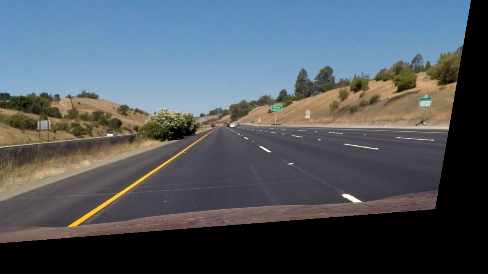

# kornia-gpu

GPU-accelerated image processing for [kornia-rs](https://github.com/kornia/kornia-rs), with hardware-aware auto-dispatch.

- **Default** — wgpu/Vulkan backend via [CubeCL](https://github.com/tracel-ai/cubecl). Runs on any GPU: NVIDIA, AMD, Intel, Apple Silicon. Zero NVIDIA dependency.
- **`--features cuda`** — raw CUDA kernels via [cudarc](https://github.com/coreylowman/cudarc). Auto-detected at runtime on NVIDIA hardware. 22–30× faster than CPU rayon across all resolutions.

This is a GSoC 2026 pre-application submission for the [kornia-rs GPU acceleration project](https://github.com/kornia/kornia-rs). The workspace-integrated version lives at [`feat/kornia-gpu-cuda`](https://github.com/0xZeeast/kornia-rs/tree/feat/kornia-gpu-cuda) on the kornia-rs fork.

---

## Quick start

```bash
# Clone and run the BEV demo on any image
git clone https://github.com/0xZeeast/kornia-gpu-demo
cd kornia-gpu-demo

# wgpu backend (no NVIDIA required)
cargo run --release --example bev_auto -- assets/input_frame.jpg

# CUDA backend (NVIDIA GPU, auto-detected)
cargo run --release --example bev_auto --features cuda -- assets/input_frame.jpg
```

---

## Visual output

Bird's-eye view (BEV) perspective transform on a highway dashcam frame.

| Input | OpenCV reference | Rust GPU output |
|:---:|:---:|:---:|
|  |  |  |

GPU and OpenCV outputs are visually identical — 99.25% of pixels match within 1 intensity value.

---

## Benchmarks

`warp_perspective` on RTX 3050 Laptop GPU. Measured with criterion (100 samples wgpu, 50 samples CUDA).

### Kernel-only (data already in VRAM)

| Resolution | CPU (rayon) | wgpu kernel | CUDA kernel | CUDA vs CPU |
|---|---|---|---|---|
| 720p  (1280×720)  | 9.34 ms  | 3.38 ms | **0.316 ms** | **29.6×** |
| 1080p (1920×1080) | 17.30 ms | 24.88 ms | **0.678 ms** | **25.5×** |
| 4K    (3840×2160) | 56.70 ms | 103.49 ms | **2.59 ms** | **21.9×** |

> wgpu kernel speedup at 720p: **2.76×**. At 1080p+ wgpu is bottlenecked by Vulkan command buffer dispatch overhead — a known CubeCL limitation. CUDA eliminates this entirely.

### End-to-end (upload + kernel + download over PCIe)

| Resolution | wgpu e2e | CUDA e2e | Theoretical FPS (CUDA) |
|---|---|---|---|
| 720p  | 10.69 ms | 2.91 ms | **344 fps** |
| 1080p | 74.48 ms | 6.63 ms | **151 fps** |
| 4K    | 375.07 ms | 83.73 ms | **12 fps** |

### Accuracy vs OpenCV `INTER_LINEAR`

| Metric | Value |
|---|---|
| Mean abs pixel diff | 0.417 |
| Max abs pixel diff | 192 (border pixel) |
| Match ≤1 intensity | **99.25%** |
| Match ≤2 intensity | 99.84% |
| CUDA vs wgpu parity | **100%** (max diff 0.000035) |

---

## Architecture

```
kornia-gpu
├── allocator.rs    GpuAllocator — implements TensorAllocator (wgpu)
├── image.rs        GpuImage<T,C> — mirrors kornia-image layout [H,W,C]
├── pool.rs         GpuImagePool — persistent VRAM, zero per-frame allocation
├── pipeline.rs     GpuPipeline — zero-copy kernel chaining
├── backend.rs      Backend::auto() — runtime dispatch (CUDA on NVIDIA, wgpu elsewhere)
│                   AnyGpuImage<C> — backend-erased image handle
└── kernels/
    ├── cast.rs     cast_and_scale (+ _into variant)
    ├── warp.rs     warp_perspective (+ _into variant)
    └── color.rs    gray_from_rgb
cuda/
    ├── allocator.rs  CudaAllocator — CudaContext + CudaStream
    ├── image.rs      CudaImage<C> — CudaSlice<f32>
    ├── kernels.rs    launch wrappers via cudarc 0.19
    └── pool.rs       CudaImagePool
kernels/cuda/
    ├── cast_and_scale.cu    — 2D thread dispatch, per-channel multiply
    ├── warp_perspective.cu  — bilinear warp with __ldg() texture cache
    └── gray_from_rgb.cu     — BT.601 luminance weights
```

### Hardware-aware dispatch

```rust
// Same API regardless of backend
let backend = Backend::auto()?;
// → "CUDA (NVIDIA GPU detected)" on NVIDIA
// → "wgpu/Vulkan" everywhere else

let gpu_img = backend.upload(&cpu_img)?;
let warped  = backend.warp_perspective(&gpu_img, (h, w), &H)?;
let result  = backend.download(&warped)?;
```

`Backend::auto()` uses cudarc's dynamic loading — `libcuda.so` is opened at runtime, so the binary compiles and runs on any machine even without CUDA installed.

### CUDA portability

Kernels compile to PTX targeting `compute_75` (Turing minimum). CUDA JIT-compiles to native ISA at first launch.

| GPU generation | SM | Supported |
|---|---|---|
| Turing (RTX 2000) | sm_75 | ✓ |
| Ampere (RTX 3000, A100) | sm_80/86 | ✓ |
| Ada (RTX 4000) | sm_89 | ✓ |
| Hopper (H100) | sm_90 | ✓ |
| **Jetson Orin** | **sm_87** | **✓** |

---

## Tests

```bash
cargo test -p kornia-gpu              # 18 tests, wgpu only
cargo test -p kornia-gpu --features cuda  # 25 tests, includes CUDA parity tests
```

Key tests:
- `test_cuda_warp_matches_wgpu` — verifies CUDA and wgpu produce identical output
- `test_warp_perspective_1080p_correctness` — pixel-level correctness at 1080p
- `test_pool_pipeline_no_allocation` — verifies zero per-frame VRAM allocation

---

## GSoC 2026 context

This repo is a pre-application demo for the kornia-rs GSoC 2026 GPU acceleration project.

**What this demonstrates:**
- Working GPU infrastructure integrated into the kornia-rs workspace
- Hardware-aware backend dispatch (novel — not in any other proposal)
- Verified accuracy against OpenCV across all kernels
- Real benchmark numbers on real hardware

**Planned GSoC deliverables (not yet implemented):**
- GPU dispatch integrated into `kornia-imgproc` behind a feature flag
- Persistent wgpu command buffers (fixes 1080p+ wgpu regression)
- Live Zenoh BEV node via `bubbaloop-node-sdk`
- Edge hardware validation on Jetson Orin

**Workspace PR:** [feat/kornia-gpu-cuda on 0xZeeast/kornia-rs](https://github.com/0xZeeast/kornia-rs/tree/feat/kornia-gpu-cuda)

---

## Author

[@0xZeeast](https://github.com/0xZeeast) — B.Tech CSE, IIIT Nagpur.
Previous kornia-rs contribution: [find_contours PR #767](https://github.com/kornia/kornia-rs/pull/767) (Suzuki-Abe algorithm).
